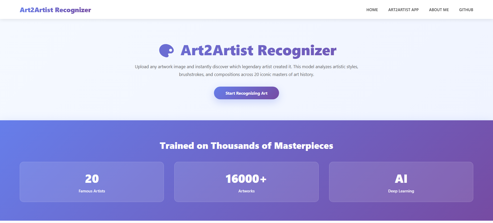
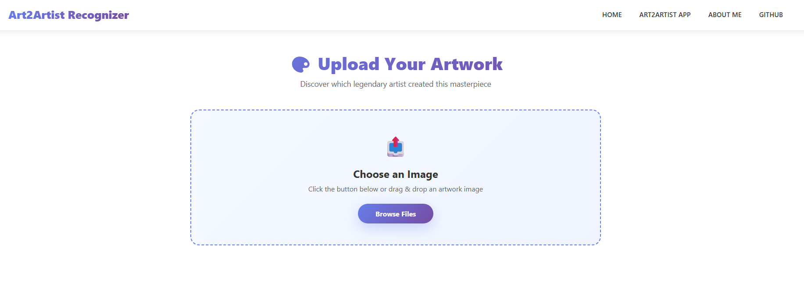

# Art2Artist-Recognizer
An image classification model from data collections, cleaning, model training, deployment, and API integration.  
It can classify 20 famous artists based on their artworks.  
The artists are:  
1. Caravaggio
2. Claude Monet
3. Diego Rivera
4. Edgar Degas
5. Edvard Munch
6. Frida Kahlo
7. Gustav Klimt
8. Henri Matisse
9. Jackson Pollock
10. Joan Miró
11. Leonardo da Vinci
12. Mark Rothko
13. Michelangelo
14. Pablo Picasso
15. Paul Cézanne
16. Pierre-Auguste
17. Raphael
18. Rembrandt van Rijn
19. Salvador Dalí
20. Vincent van Gogh

# Dataset Preparation
**Data Collection:** Downloaded from DuckDuckGo using term name and [kaggle WikiArt dataset](https://www.kaggle.com/datasets/steubk/wikiart).  
**DataLoader:** Used fastai DataBlock API to set up the DataLoader.  
**Data Augmentation:** fastai provides default data augmentation which operates in GPU.  
Details can be found in `notebooks/data_prep.ipynb`

# Training and Data Cleaning
**Training:** Fine-tuned a resnet34 model for 5 epochs (3 times) and got upto 88% accuracy.  
**Data Cleaning:** The most time consuming part of the project was data cleaning. It was crucial to have clean and relevant dataset to get good accurate predictions. I had to clean up most of the images scraped from duckduckgo and merged it with kaggle's WikiArt dataset so the predictions will be more accurate. 

# Model Deployment
The model was deployed in HuggingFace Spaces Gradio App. The implementation can be found in `deployment` folder or [here](https://huggingface.co/spaces/goldphish2209/art2artist-recognizer).  

# API integration with GitHub Pages
The deployed model API is integrated [here](https://naawshin.github.io/Art2Artist-Recognizer/) in GitHub Pages Website. Implementation and other details can be found in `docs` folder.

 