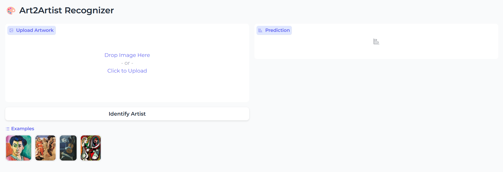
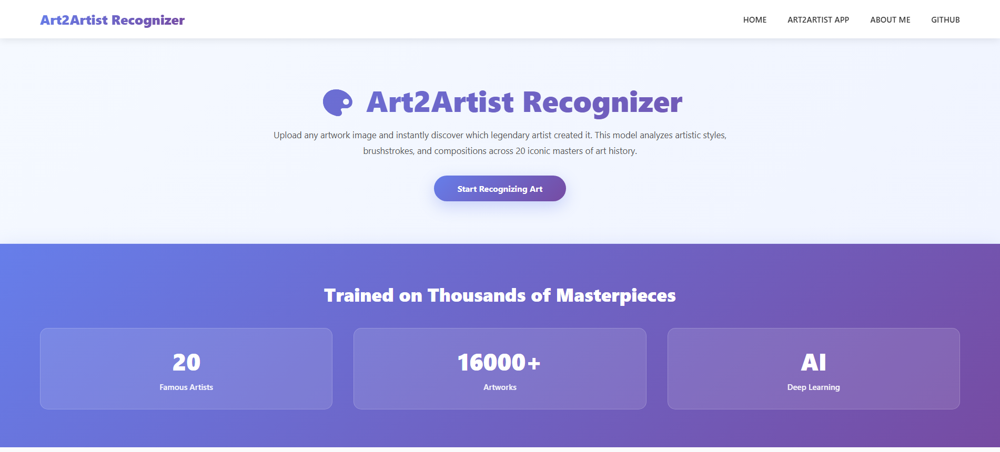
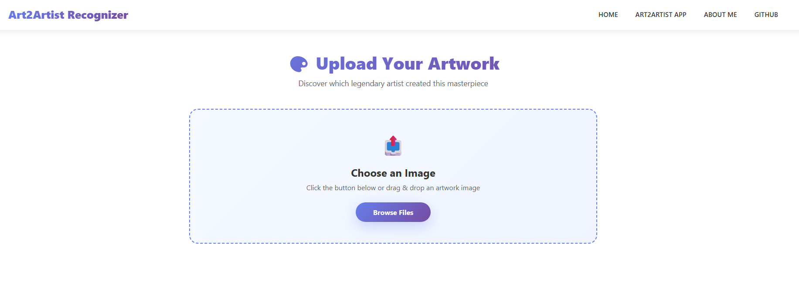

# Art2Artist-Recognizer
An end to end image classifier covering data collections, cleaning, model training, deployment, and API integration.  
It can classify 20 famous artists based on their artworks.  
The artists are:  
1. Caravaggio
2. Claude Monet
3. Diego Rivera
4. Edgar Degas
5. Edvard Munch
6. Frida Kahlo
7. Gustav Klimt
8. Henri Matisse
9. Jackson Pollock
10. Joan Miró
11. Leonardo da Vinci
12. Mark Rothko
13. Michelangelo
14. Pablo Picasso
15. Paul Cézanne
16. Pierre-Auguste
17. Raphael
18. Rembrandt van Rijn
19. Salvador Dalí
20. Vincent van Gogh

# Dataset Preparation
**Data Collection:** Downloaded from DuckDuckGo using term name and [kaggle WikiArt dataset](https://www.kaggle.com/datasets/steubk/wikiart). 
- Original dataset size: ~20,000 images  
- After cleaning: ~16,000 high-quality images

**DataLoader:** Used fastai DataBlock API to set up the DataLoader.  
**Data Augmentation:** fastai provides default data augmentation which operates in GPU which includes Random resized crops (min_scale=0.5), multiple augmentations with 2.0 multiplier.  
Details can be found in `notebooks/data_prep.ipynb`

# Training and Data Cleaning
**Training:** 
- Utilized transfer learning with pretrained models
- Fine-tuned models over 3 cycles of 5 epochs each

**Data Cleaning:** The most time consuming part of the project was data cleaning. It was crucial to have clean and relevant dataset to get good accurate predictions. I had to clean up most of the images scraped from duckduckgo and merge it with kaggle's WikiArt dataset so the predictions will be more accurate. 

# Model Comparison 
| Model   | Architecture | Dataset Size | Accuracy |
|----------|--------------|---------------|-----------|
| Model 1  | ResNet34     | 16,000 images | **88%**   |
| Model 2  | ResNet50     | 16,000 images | **90%**   |

ResNet50 achieved higher accuracy due to its deeper architecture and improved feature extraction capabilities.

# Model Deployment
The model was deployed in HuggingFace Spaces Gradio App. The implementation can be found in `deployment` folder or [here](https://huggingface.co/spaces/goldphish2209/art2artist-recognizer).  
<figure>
  
  <figcaption><b>Figure 1:</b> Gradio App Interface of the Deployed Model</figcaption>
</figure>

# API integration with GitHub Pages
The deployed model API is integrated [here](https://naawshin.github.io/Art2Artist-Recognizer/) in GitHub Pages Website. Implementation and other details can be found in `docs` folder.
<figure>
  
  <figcaption><b>Figure 2:</b> Model integrated on GitHub Pages Homepage Interface</figcaption>
</figure>

<figure>
  
  <figcaption><b>Figure 3:</b> Art2Artist Recognizer App Interface</figcaption>
</figure>

# Summary
- Built using **fastai** and **PyTorch**
- Implemented **transfer learning** with ResNet34 and ResNet50
- Curated and cleaned **20k+ images** from DuckDuckGo and Kaggle WikiArt
- Achieved up to **90% accuracy** in artist classification
- Deployed on **Hugging Face Spaces** with **Gradio**
- Integrated via API on **GitHub Pages** for web-based access
