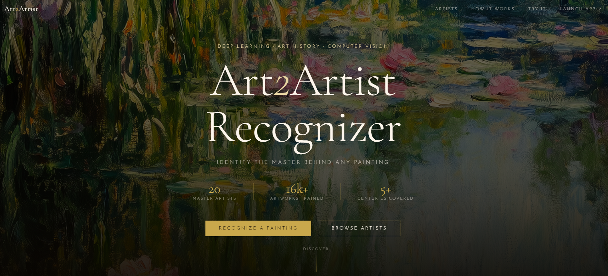
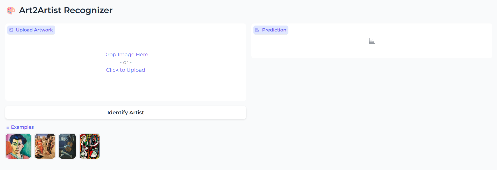
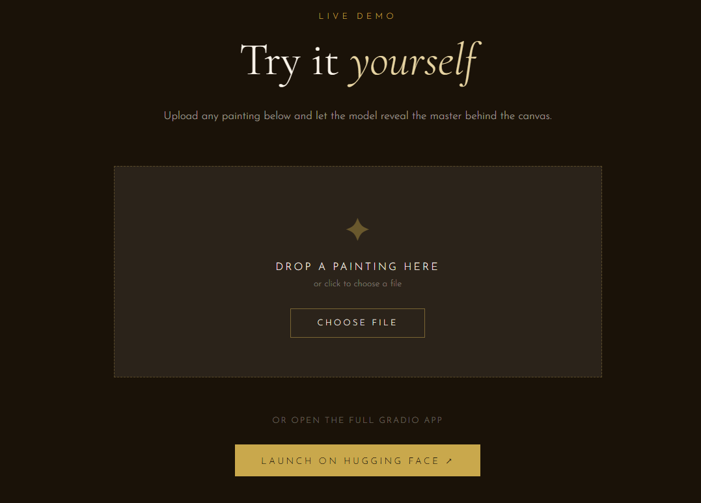

# 🎨 Art2Artist Recognizer

> An end-to-end deep learning image classifier that identifies the master behind any painting — spanning data collection, cleaning, model training, deployment, and API integration.

  
   
  <em>Art2Artist Recognizer — Web Interface</em>

  
  
  
  

## 📦 Dataset Preparation

**Data Collection** was sourced from two places:
- **DuckDuckGo** — images scraped by artist name
- **[Kaggle WikiArt Dataset](https://www.kaggle.com/datasets/steubk/wikiart)** — curated art repository

| Stage | Image Count |
|---|---|
| Raw collected | ~20,000 |
| After cleaning | ~16,000 |

**DataLoader** — Built with the [fastai DataBlock API](https://docs.fast.ai/data.block.html).

**Data Augmentation** — fastai's default GPU-accelerated augmentation pipeline:
- Random resized crops (`min_scale=0.5`)
- Multiple augmentations with `2.0` multiplier

> See `notebooks/data_prep.ipynb` for full details.

---

## 🏋️ Training & Data Cleaning

### Training

- Transfer learning with pretrained ResNet architectures
- Fine-tuned over **3 cycles × 5 epochs each**

### Data Cleaning

The most time-consuming phase of the project. Images scraped from DuckDuckGo required extensive manual review and cleaning before being merged with the WikiArt dataset to produce high-quality, relevant training examples.

---

## 📊 Model Comparison

| Model | Architecture | Dataset Size | Accuracy |
|---|---|---|---|
| Model 1 | ResNet34 | 16,000 images | 88% |
| Model 2 | ResNet50 | 16,000 images | **90%** ✅ |

**ResNet50** was selected as the final model — its deeper architecture enables richer feature extraction, capturing the subtle stylistic signatures that distinguish each artist.

---

## 🚀 Deployment

The model is deployed as a **Gradio app on Hugging Face Spaces**.

  
   
  <em>Gradio App — Deployed on Hugging Face Spaces</em>

🔗 **Live app:** [huggingface.co/spaces/goldphish2209/art2artist-recognizer](https://huggingface.co/spaces/goldphish2209/art2artist-recognizer)

> Implementation details in the `deployment/` folder.

---

## 🌐 API Integration (GitHub Pages)

The Gradio model API is integrated into a GitHub Pages website for browser-based access without any local setup.

  
   
  <em>Art2Artist — GitHub Pages Live Demo</em>

🔗 **Website:** [naawshin.github.io/Art2Artist-Recognizer](https://naawshin.github.io/Art2Artist-Recognizer/)

> Implementation details in the `docs/` folder.

---

## 🛠️ Tech Stack

| Component | Technology |
|---|---|
| Deep learning framework | fastai + PyTorch |
| Model architectures | ResNet34, ResNet50 |
| Data sources | DuckDuckGo scraping, Kaggle WikiArt |
| Deployment | Hugging Face Spaces + Gradio |
| Web integration | GitHub Pages |
| Training strategy | Transfer learning + fine-tuning |

---

## ✨ Summary

- 🧠 Built with **fastai** and **PyTorch**
- 🔁 **Transfer learning** with ResNet34 and ResNet50
- 🖼️ Curated and cleaned **20k+ images** from DuckDuckGo and Kaggle WikiArt
- 🎯 Achieved up to **90% accuracy** in artist classification
- ☁️ Deployed on **Hugging Face Spaces** with Gradio
- 🌐 Integrated via API on **GitHub Pages** for web-based access

---

## 👩‍💻 Author

**Nowshin Tabasum** — AI Engineer

